# open-mmi

Open vehicle MMI integration framework for Linux.

`open-mmi` is an early GPLv3 vehicle integration project that connects passive vehicle CAN-bus data to configurable Linux actions, persistent vehicle state, and UI/dashboard consumers.

> Where hex meets human form.

## One shared human language for every vehicle

Open MMI's canonical registries are **continuity checkpoints, not a walled garden**.
Anyone may investigate CAN data, share provisional findings and propose support for a new
vehicle concept. Before a signal enters a maintained profile, it is translated into a
human-readable meaning shared by every vehicle.

Different cars may use different CAN IDs, bytes and values for the same control:

```json
{
  "id": "0x5C1",
  "byte": 0,
  "value": 43,
  "event": "mute_toggle"
}
```

```json
{
  "id": "0x431",
  "byte": 2,
  "value": 17,
  "event": "mute_toggle"
}
```

Only the hexadecimal mapping changes. The human meaning remains `mute_toggle`.
When no existing descriptor fits a genuinely new concept, the contributor adds a universal
registry entry in the same pull request as the vehicle mapping—no separate permission gate.

Read the [vehicle signal contribution workflow](docs/vehicle-contribution-workflow.md) and
[vehicle integration standard](docs/vehicle-integration-standard.md) before promoting raw
CAN observations into a maintained profile.

---

## Current status

`open-mmi` is currently an **alpha vehicle integration project** with a working local web dashboard and backend/status layer.

The current maintainer-tested reference vehicle is:

```text
Seat Leon 1P / VAG PQ35
```

The current focus is:

```text
SocketCAN receive
profile-driven CAN decoding
persistent vehicle status snapshots
local Linux actions
CLI/dashboard consumers
safe user configuration
vehicle-profile contribution workflow
```

This is **not yet** a finished infotainment replacement or multi-vehicle supported product, but the dashboard is now a real development target rather than only a terminal/status prototype.

The goal is to build a reusable open foundation so vehicle-specific CAN knowledge can live in shareable profiles instead of being rediscovered privately.

See [`docs/project-philosophy.md`](docs/project-philosophy.md) for the project goals and community philosophy.

<!-- OPEN_MMI_WEB_DASHBOARD_START -->
## Factory web dashboard

Open MMI now includes a local, read-only, tablet-friendly web dashboard that consumes the same persistent vehicle status snapshot as the diagnostic tools.
It is intended to make decoded vehicle state visible as a practical in-car interface, not just as raw CAN frames or terminal output.

<p align="center">
  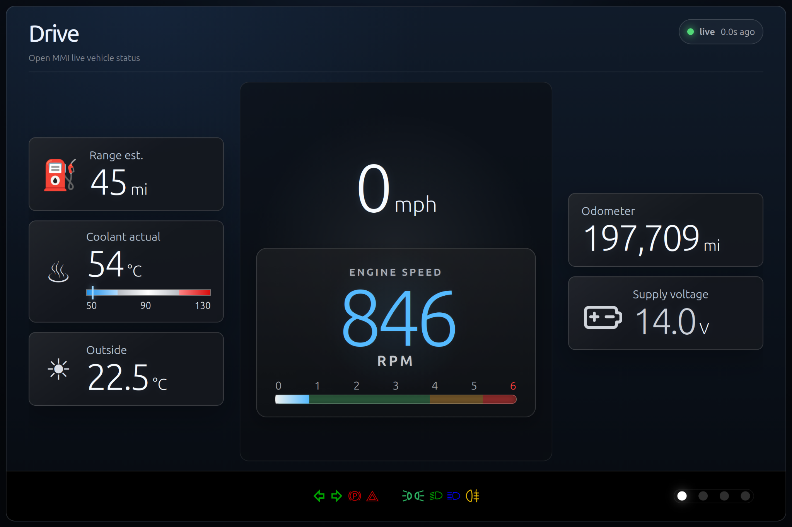
</p>

| Media | Climate |
|---|---|
| 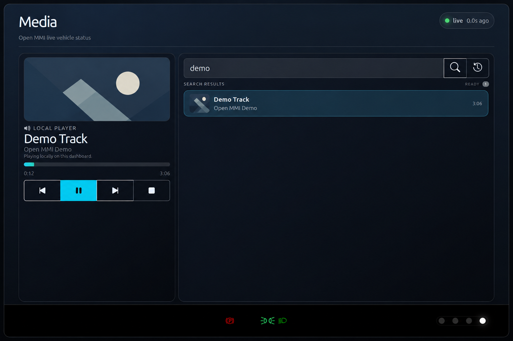 | 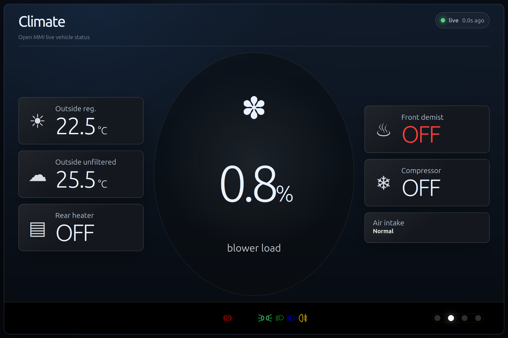 |
| Vehicle | Diagnostics/status |
| 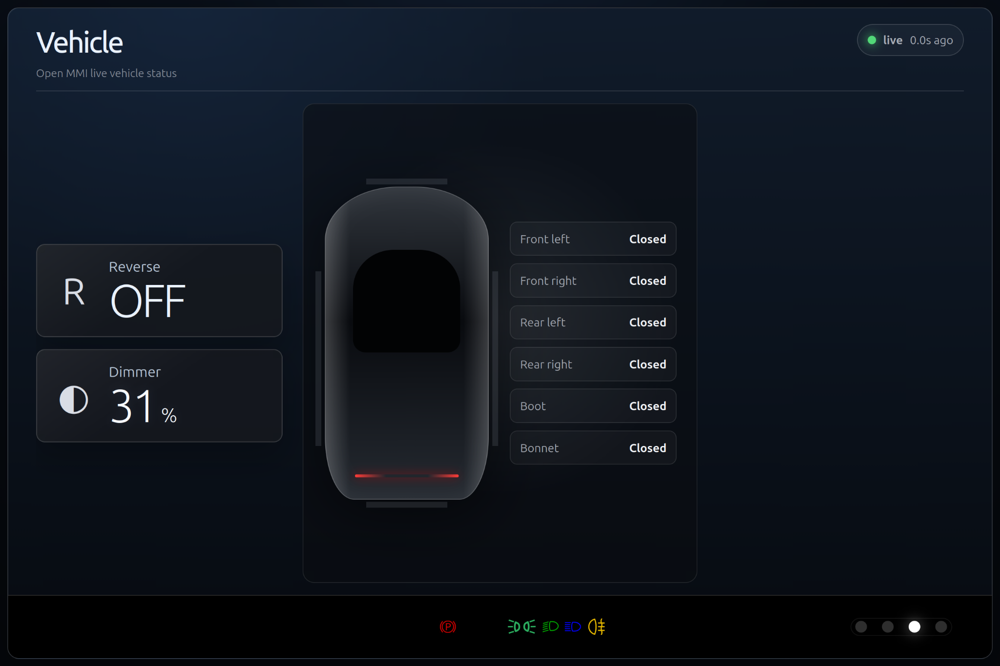 | 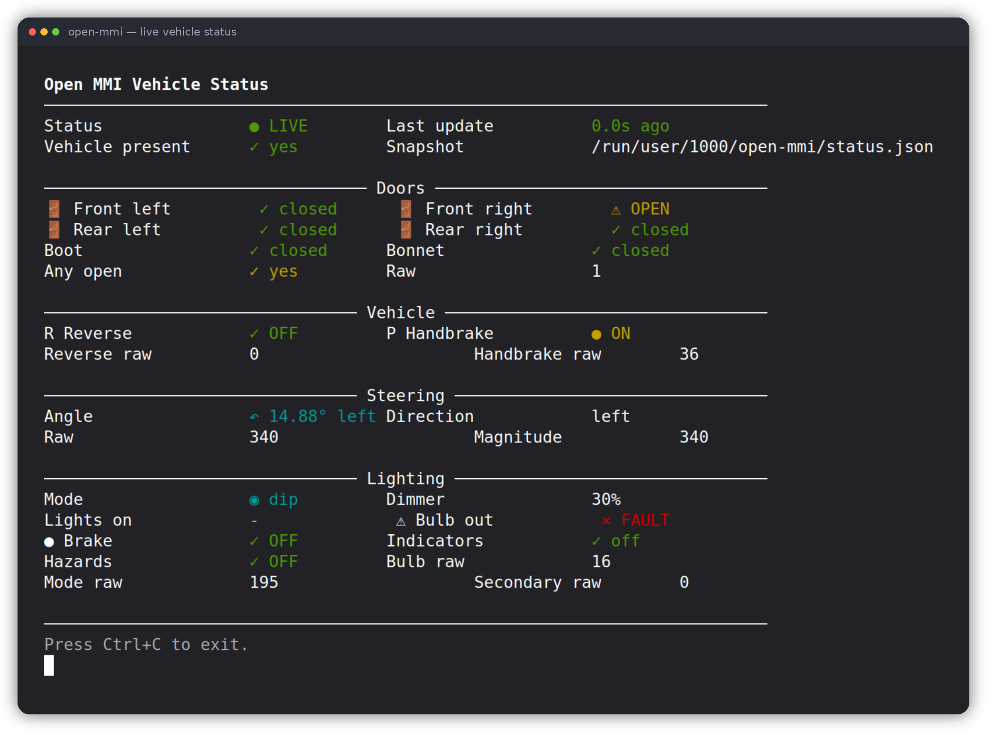 |

Current web dashboard pages:

* **Drive** — speed, RPM, coolant, voltage, range/odometer, outside temperature, and OEM-style footer tell-tales.
* **Media** — optional Jellyfin music search/playback using server-side credentials, user/library scoping, and local browser audio playback.
* **Climate** — blower load, outside temperature, demist/compressor/heater/intake state where available from the status snapshot.
* **Vehicle** — doors, reverse, dimmer and body-state information where available from the status snapshot.

Run it from a checkout:

```bash
python3 ui/web_dashboard/server.py
```

Try the dashboard away from the car with dynamic demo data:

```bash
python3 ui/web_dashboard/server.py --demo --demo-scenario traffic
```

More details, including Jellyfin configuration, tell-tale test mode, media keys, demo scenarios, and icon attribution notes, are in [`ui/web_dashboard/README.md`](ui/web_dashboard/README.md).

### Installed desktop and media configuration

The installed desktop icon uses the remembered Web/TUI selection. Configure it in **Settings → System** or from the CLI:

```bash
open-mmi-config launcher status
open-mmi-config launcher default web
open-mmi-config launcher autostart enable
```

Configure Jellyfin in **Settings → Media → Jellyfin setup** or interactively:

```bash
open-mmi-config jellyfin setup
open-mmi-config jellyfin test
open-mmi-config dashboard restart
```

Credentials are stored server-side in `~/.config/open-mmi/dashboard.env` with mode `0600`. The dashboard browser receives only redacted configuration state and never receives the stored password or token. Environment variables remain supported for development launches and can be imported with `open-mmi-config jellyfin import-env`.

See [`docs/desktop-shell.md`](docs/desktop-shell.md) for launcher, login-autostart, and advanced service details and [`ui/web_dashboard/README.md`](ui/web_dashboard/README.md) for Jellyfin scope and security guidance.

See [`docs/runtime-hardening.md`](docs/runtime-hardening.md) for update/cache recovery, service reconnection, thermal diagnostics, and runtime-efficiency behaviour. Vehicle installations should also review [`docs/vehicle-tablet-installation.md`](docs/vehicle-tablet-installation.md).

The `v1-update-management` branch adds confirmed manual nightly updates under **Settings → System** plus trusted administrative channel policy. The dashboard never selects a repository, ref, or channel. Inspect or operate the same fixed flow from the CLI with:

```bash
open-mmi-config updates status
open-mmi-config updates check
open-mmi-config updates readiness
open-mmi-config updates coordinator
open-mmi-config vehicle-setup coordinator
open-mmi-config vehicle-setup preview seat_1p default --bus comfort --interface can0
open-mmi-config updates prepare
open-mmi-config updates install
```

Select one approved channel administratively:

```bash
sudo open-mmi-config updates channel nightly
sudo open-mmi-config updates channel beta
sudo open-mmi-config updates channel stable
```

Nightly remains bound to the installer-recorded branch. Beta and stable require the official Open MMI repository, `main`, and fixed semantic release-tag forms; downgrade and rewritten-tag states fail closed. Existing `development` policy files migrate automatically to `nightly`. A restricted privileged coordinator prepares a nightly candidate and invokes a separate no-arguments one-shot installer from either the fixed CLI or same-origin browser flow. Browser channel selection, scheduling, unattended updates, manual rollback, and stable/beta installation remain disabled.

A first managed install may add the account to the dedicated `open-mmi-update` group. Log out and back in once when the installer requests it; an already-running desktop session cannot inherit new supplementary group membership, so browser update actions remain unavailable until the next login. See the [update-management design set](docs/design/v1-update-management/README.md) and [qualification record](docs/design/v1-update-management/qualification.md).
<!-- OPEN_MMI_WEB_DASHBOARD_END -->

---

## Current tagged checkpoint

The existing `v1.0.0-backend` tag represents an early backend checkpoint, not a final Open MMI product release.

It proves the first backend foundation:

* CAN input via SocketCAN
* profile-driven vehicle decoding
* configurable event dispatch
* modular Linux actions
* timeout-based vehicle presence
* persistent vehicle status snapshots
* explicit opt-in user overrides under `~/.config/open-mmi`
* install/update/uninstall tooling
* CLI dashboard prototype

Future GitHub Releases will use clearer alpha versioning, release notes, known limitations, screenshots or example output, and a clear source checkpoint.

See [`docs/versioning.md`](docs/versioning.md) for the project versioning policy.

---

## What open-mmi is for

`open-mmi` is designed for:

* Linux car PC projects
* tablet-based vehicle integrations
* steering wheel media controls
* lightweight vehicle dashboards
* reverse-engineered vehicle integrations
* local vehicle state/status display
* future dashboard and UI consumers

The project currently focuses on local, passive CAN receive and Linux-side actions.

It does not currently provide active CAN transmit/control behaviour.

---

## What open-mmi supports today

Current capabilities include:

* SocketCAN input
* vehicle profiles
* user bindings
* modular actions
* profile-driven status/state mappings
* persistent status snapshot output
* CLI diagnostic dashboard and local web dashboard consumers
* hot-reload configuration
* off-car safe mode
* systemd + udev integration
* explicit opt-in user override directory under `~/.config/open-mmi`
* local web dashboard files plus optional Linux desktop launcher assets for the diagnostic status dashboard

---

## Screenshots and visual proof

The UI is currently alpha. These screenshots should be treated as proof of the backend/status pipeline, install tooling, and diagnostic consumers, not as a final infotainment or tablet interface.

### Status dashboard alpha

The lightweight status dashboard consumes the persistent Open MMI status snapshot and displays current vehicle state for diagnostics.


Additional dashboard states:

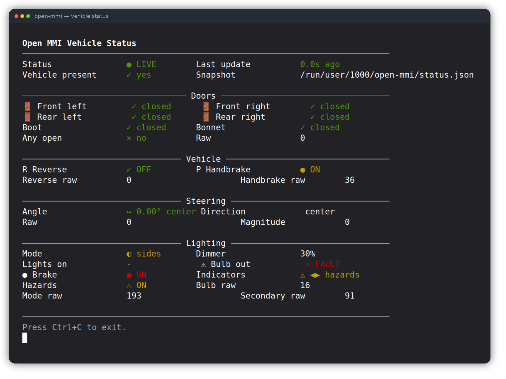

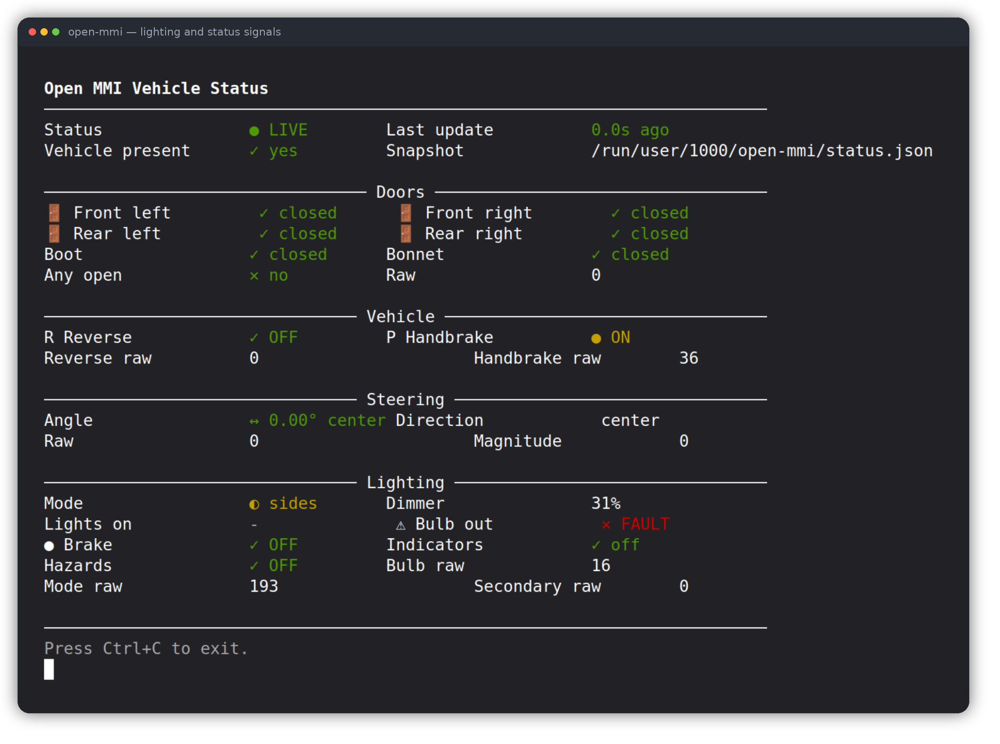

### Install and management tooling

The management script handles install, update, status, logs, and uninstall flows.

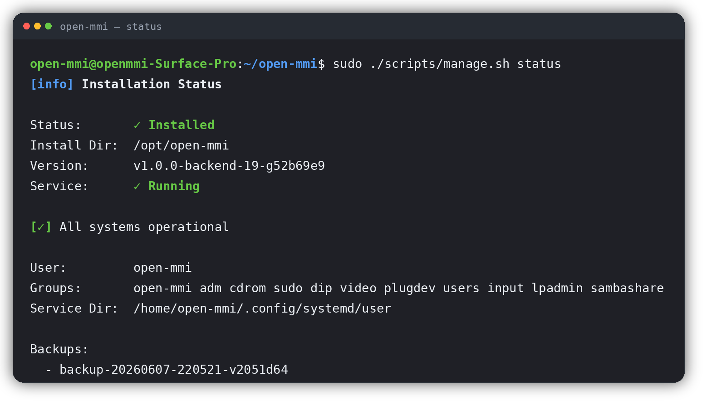

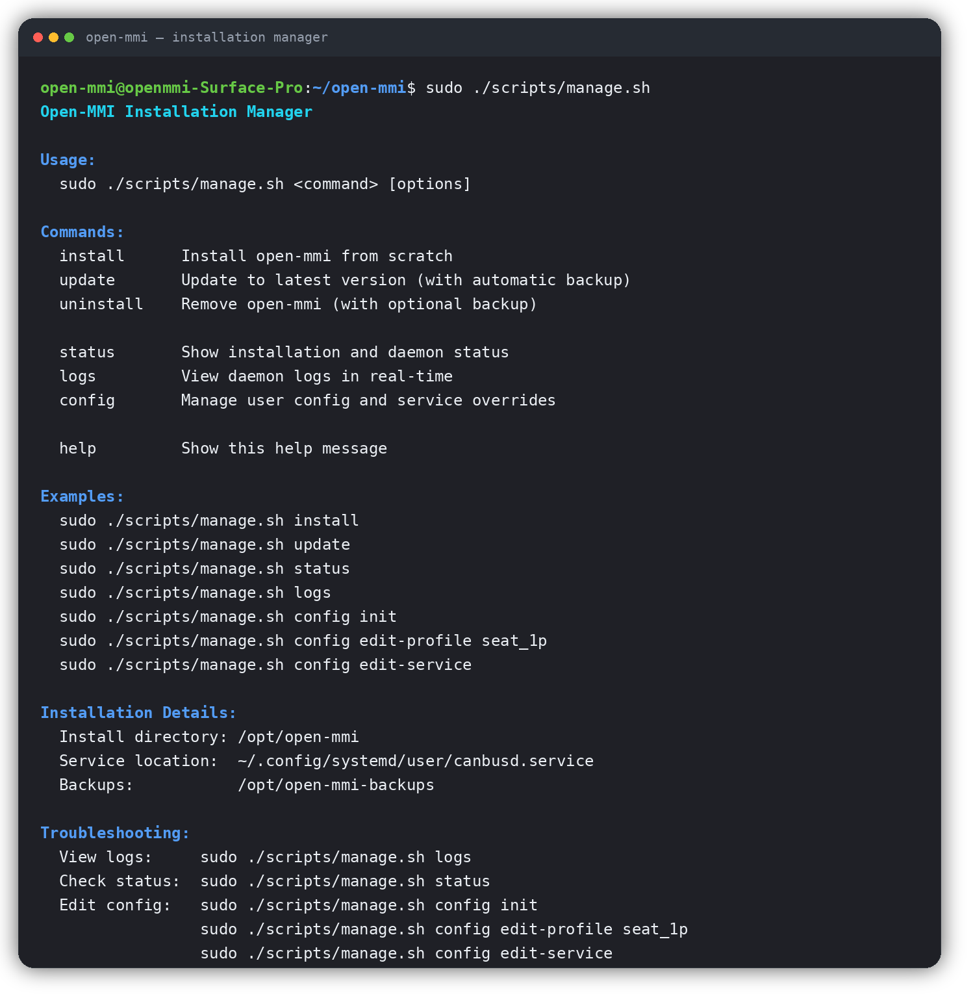

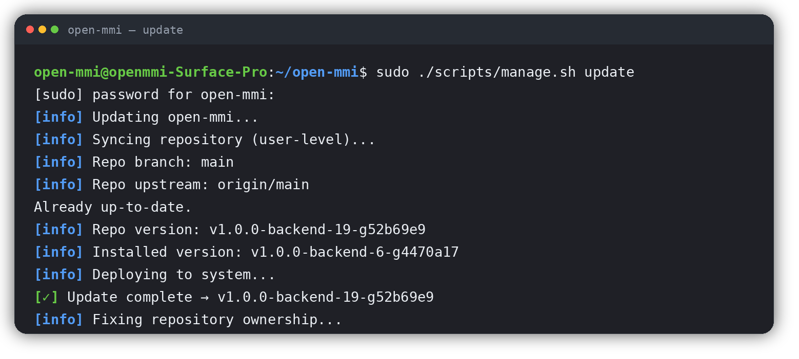

### Daemon logs

The daemon logs show backend activity, status updates, and service diagnostics.

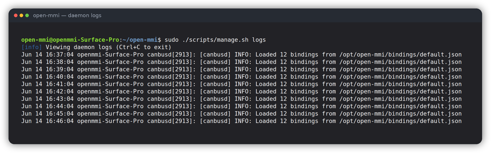

---

## Branches

`main` is intended to stay conservative and usable.

Development work should happen on feature or beta branches before being merged into `main`.

Recommended workflow:

```bash
# Main branch
git switch main

# New development branch
git switch -c beta/my-feature
```

For real vehicle testing, keep working changes on a beta branch until they have been tested on the car.

Backend checkpoints may be tagged, for example:

```bash
git checkout v1.0.0-backend
```

A git tag is not the same thing as a GitHub Release. Future public GitHub Releases will include release notes, known limitations, screenshots or example output, and a clear source checkpoint.

---

# Quick Start

## 1. Get the code

```bash
git clone https://github.com/open-mmi/open-mmi.git
cd open-mmi
```

## 2. Install

```bash
sudo ./scripts/manage.sh install
```

This will:

* install system dependencies
* create `/opt/open-mmi`
* create an isolated Python virtual environment
* install Python packages
* copy application files to `/opt/open-mmi`
* copy management scripts to `/opt/open-mmi/scripts`
* copy UI/dashboard files to `/opt/open-mmi/ui`
* install the CAN daemon and dashboard systemd user services
* configure user permissions
* start the CAN daemon and make the dashboard available on demand

## 3. Verify installation

```bash
sudo ./scripts/manage.sh status
```

Expected output:

```text
Status: ✓ Installed
Install Dir: /opt/open-mmi
Version:
Service: ✓ Running
```

## 4. View logs

```bash
sudo ./scripts/manage.sh logs
```

Press `Ctrl+C` to exit logs.

## 5. Open Open MMI

The installer provides the universal launcher and desktop integration:

```bash
open-mmi-launcher
```

The desktop icon uses the remembered Web/TUI choice. The independent **Open MMI Interface Chooser** application always opens the selector, so a touchscreen-only installation can recover even when the Terminal UI is remembered. The launcher starts the dashboard service on demand, waits for `/api/health`, and then opens or reuses the managed browser window.

For development away from the car:

```bash
python3 ui/web_dashboard/server.py --demo --demo-scenario traffic
```

The diagnostic terminal UI remains available:

```bash
open-mmi-status
open-mmi-status --once
open-mmi-status --raw
```

## 6. Desktop and login behaviour

Install and update deploy the application-menu entry, desktop shortcut, repository icons, and packaged commands automatically. Configure the remembered interface and whether Open MMI itself opens after graphical login in **Settings → System**, or use:

```bash
open-mmi-config launcher default web
open-mmi-config launcher autostart enable
open-mmi-config launcher autostart disable
```

Application autostart is stored at `~/.config/autostart/open-mmi.desktop`. The dashboard service is started on demand by the launcher. Advanced service controls are CLI-only:

```bash
open-mmi-config dashboard status
open-mmi-config dashboard start
open-mmi-config dashboard stop
open-mmi-config dashboard restart
open-mmi-config dashboard enable
open-mmi-config dashboard disable
```

---

# Safety note

This project interfaces with vehicle CAN buses.

`open-mmi` currently focuses on passive CAN receive and local Linux actions.

Do not add vehicle CAN transmit/control behaviour without a separate safety design, explicit allowlists, warnings, maintainer review, and extensive testing.

Decoded status is informational and should not be treated as a replacement for OEM safety warnings, diagnostics, or driver judgement.

---

# How it works

## Runtime flow

```text
CAN frame from vehicle
        ↓
canbusd/core.py
        ↓
active vehicle profile
        ↓
rules / presence / status mappings
        ↓
dispatcher + event bus + status bus
        ↓
actions and dashboards
```

The core idea is that vehicle-specific CAN knowledge should live in vehicle profiles, not hardcoded into the daemon.

Named CAN bus metadata is documented in [`docs/can-bus-model.md`](docs/can-bus-model.md).

See [`docs/vehicle-profiles.md`](docs/vehicle-profiles.md) for the profile boundary and [`docs/vehicle-integration-standard.md`](docs/vehicle-integration-standard.md) for the canonical event and contribution contract. The generated event catalogue is [`docs/vehicle-event-registry.md`](docs/vehicle-event-registry.md).

---

# Architecture

```text
open-mmi/
├── canbusd/
│   ├── core.py              ← daemon loop: CAN input, profile loading
│   ├── dispatcher.py        ← event → event bus + action execution
│   ├── event_bus.py         ← in-process pub/sub for events
│   ├── status_bus.py        ← persistent vehicle state snapshots
│   ├── status_rules.py      ← generic profile-driven status evaluator
│   └── __init__.py
│
├── vehicles/
│   └── seat_1p/
│       └── config.json      ← vehicle CAN profile
│
├── bindings/
│   └── default.json         ← canonical event → action mapping
│
├── ui/data/
│   └── vehicle-events.v1.json ← canonical vehicle-event registry
│
├── actions/
│   ├── audio.py
│   ├── brightness.py
│   ├── keys.py
│   ├── screen.py
│   └── __init__.py
│
├── ui/
│   └── dashboard/
│       └── status_cli.py    ← CLI diagnostic dashboard
│
├── scripts/
│   ├── manage.sh            ← install/update/uninstall/config
│   └── manage.sh            ← install/update/uninstall and desktop lifecycle
│
├── packaging/
│   └── linux-desktop/
│       ├── open-mmi-status.desktop
│       ├── open-mmi-chooser.desktop
│       └── icons/
│           ├── hicolor/
│           ├── open-mmi-dark/
│           └── open-mmi-light/
│
├── docs/
│   └── images/
│       ├── daemon-logs.png
│       ├── install-status.png
│       ├── manage-help.png
│       ├── status-dashboard-active.png
│       ├── status-dashboard-closed.png
│       ├── status-dashboard-lighting.png
│       └── update-flow.png
│
├── systemd/
│   └── user/
│       └── canbusd.service
│
├── udev/
│   └── 80-canbus.rules
│
├── pyproject.toml
├── README.md
└── LICENSE
```

---

# Three profile concepts

Vehicle profiles have three distinct sections:

```text
rules
presence
status
```

## `rules`

Momentary events that can trigger actions.

Examples:

```text
volume_up
next_track
arrow_left
brightness_level
```

These events must be declared by the canonical registry in `canbusd/data/vehicle-events.v1.json`, are looked up in `bindings/*.json`, and are then routed to functions in `actions/`. Different vehicles use the same event identifier for the same universal intent.

## `presence`

Timeout-based availability checks.

Example:

```text
CAN ID 0x65F seen recently
→ vehicle.present = true
→ vehicle_present:on

CAN ID 0x65F silent too long
→ vehicle.present = false
→ vehicle_present:off
```

Presence rules are useful for detecting whether the vehicle bus is awake and for triggering local actions such as screen on/off.

## `status`

Persistent vehicle state for dashboards and future UI consumers.

Examples:

```text
doors.front_left = open
vehicle.reverse = true
vehicle.handbrake = true
lighting.mode = dip
lighting.dimmer_percent = 42
```

Status mappings are profile-driven.

The core daemon knows generic rule types such as `bool`, `enum`, `bitfield`, `percent`, `raw`, and masked boolean rules; vehicle-specific CAN knowledge stays inside `vehicles/{profile}/config.json`.

---

# Vehicle profile format

Vehicle profiles live in:

```text
vehicles/{profile}/config.json
```

A profile may contain CAN bus metadata plus rules, presence rules, and status rules:

```json
{
  "default_bus": "comfort",
  "can_buses": {
    "comfort": {
      "interface": "can0",
      "bitrate": 100000,
      "capture_point": "maintainer-tested comfort CAN connection",
      "provisioning": "udev",
      "bring_up": false
    }
  },
  "rules": [],
  "presence": [],
  "status": []
}
```

`default_bus` is used by profile entries that do not explicitly declare `bus`.

`can_buses` documents named CAN bus metadata. The daemon consumes the resolved SocketCAN interface, but it does not silently configure bitrate or bring interfaces up.

---

## `rules`

Example:

```json
{
  "rules": [
    {
      "id": "0x5C1",
      "byte": 0,
      "value": 6,
      "event": "volume_up"
    },
    {
      "id": "0x470",
      "byte": 2,
      "value": "any",
      "event": "brightness_level"
    }
  ]
}
```

`value` may be a number or `"any"`.

`"any"` means the event fires when that byte changes, and the byte value is passed as an extra argument.

---

## `presence`

Example:

```json
{
  "presence": [
    {
      "id": "0x65F",
      "timeout_ms": 6000,
      "status_path": "vehicle.present",
      "on_present": "vehicle_present:on",
      "on_absent": "vehicle_present:off"
    }
  ]
}
```

`status_path` is optional. If omitted, presence is published to:

```text
vehicle.present
```

Presence status is also written under a per-frame diagnostic key such as:

```text
presence.0x65F = true
```

`on_present` and `on_absent` are optional events.

If present, they are dispatched when the presence state changes.

---

## `status`

Status rules turn raw CAN data into persistent state.

### Bitfield

```json
{
  "id": "0x470",
  "byte": 1,
  "type": "bitfield",
  "path": "doors",
  "fields": {
    "front_right": "0x01",
    "front_left": "0x02",
    "rear_left": "0x04",
    "rear_right": "0x08",
    "bonnet": "0x10"
  },
  "equals": {
    "boot": "0x60"
  },
  "any": "any_open",
  "raw": "raw"
}
```

This produces status like:

```json
{
  "doors": {
    "front_left": true,
    "front_right": false,
    "any_open": true,
    "raw": 2
  }
}
```

### Percent

```json
{
  "id": "0x470",
  "byte": 2,
  "type": "percent",
  "path": "lighting.dimmer_percent",
  "raw_path": "lighting.dimmer_raw"
}
```

### Bool

```json
{
  "id": "0x621",
  "byte": 0,
  "type": "bool",
  "path": "vehicle.handbrake",
  "true": "0x20",
  "false": "0x00",
  "raw_path": "vehicle.handbrake_raw"
}
```

### Enum

```json
{
  "id": "0x531",
  "byte": 0,
  "type": "enum",
  "path": "lighting.mode",
  "values": {
    "0x00": "off",
    "0xC1": "sides",
    "0xC3": "dip"
  },
  "default": "unknown",
  "raw_path": "lighting.mode_raw"
}
```

---

# Bindings format

Repo/default bindings live in:

```text
bindings/{name}.json
```

Installed repo/default bindings live in:

```text
/opt/open-mmi/bindings/{name}.json
```

Optional user binding overrides may live in `~/.config/open-mmi/bindings/`, but they are used only when `OPEN_MMI_BINDINGS_FILE` is explicitly set.

Example:

```json
{
  "volume_up": {
    "module": "audio",
    "func": "volume_up",
    "args": ["+5%"]
  },
  "play_pause": {
    "module": "audio",
    "func": "play_pause"
  }
}
```

Bindings are selected with:

```ini
Environment="OPEN_MMI_BINDINGS=default"
```

Bindings are trusted local configuration. Do not install random bindings or vehicle profiles without reviewing them.

Configured actions run through a single bounded worker queue. CAN event publication and
frame decoding continue immediately while subprocess-backed actions execute in order.
The queue defaults to 64 pending actions and can be adjusted with
`OPEN_MMI_ACTION_QUEUE_SIZE` (1–1024). Queue overload is logged explicitly rather than
allowing unbounded memory growth.

---

# Config defaults and explicit overrides

Application files are installed to:

```text
/opt/open-mmi
```

Normal runtime uses repo/default configuration from the installed application tree:

```text
/opt/open-mmi/vehicles/<vehicle>/config.json
/opt/open-mmi/bindings/<bindings>.json
```

User override files may live under:

```text
~/.config/open-mmi
```

User override files are sacred: Open MMI must not overwrite, refresh, migrate, or delete them automatically.

User override files are also opt-in only. They are not selected automatically just because they exist.

See [`docs/profile-ownership.md`](docs/profile-ownership.md) for the full ownership model.

## Apply a vehicle profile

```bash
sudo ./scripts/manage.sh config apply-profile seat_1p default
```

This is the normal setup path.

It uses the selected repo/default vehicle profile and repo/default bindings as the runtime source of truth, and applies the local runtime/provisioning defaults declared by that profile.

For the Seat 1P reference profile this means:

```text
default_bus = comfort
comfort.interface = can0
comfort.bitrate = 100000
comfort.provisioning = udev
```

Applying a profile writes the daemon runtime drop-in and generates the udev rule for the declared CAN bus.

It should not create, overwrite, or select user override files under `~/.config/open-mmi`.

## Explicit user overrides

A user vehicle-profile override can be selected by setting `OPEN_MMI_VEHICLE_CONFIG` explicitly, for example:

```ini
[Service]
Environment="OPEN_MMI_VEHICLE_CONFIG=/home/open-mmi/.config/open-mmi/vehicles/seat_1p/config.json"
```

A user bindings override can be selected by setting `OPEN_MMI_BINDINGS_FILE` explicitly, for example:

```ini
[Service]
Environment="OPEN_MMI_BINDINGS_FILE=/home/open-mmi/.config/open-mmi/bindings/default.json"
```

A user override file is safe from Open MMI updates, but it also stops receiving repo/default improvements until the user updates that override manually.

## Edit service environment

```bash
sudo ./scripts/manage.sh config edit-service
```

Use this for environment variables such as:

```ini
[Service]
Environment="OPEN_MMI_VEHICLE=seat_1p"
Environment="OPEN_MMI_BINDINGS=default"
Environment="OPEN_MMI_LOG_LEVEL=DEBUG"
```

To opt into user override files, set `OPEN_MMI_VEHICLE_CONFIG` and/or `OPEN_MMI_BINDINGS_FILE` explicitly.

## Show config paths

```bash
sudo ./scripts/manage.sh config paths
```

## Lookup order

Vehicle config lookup order:

```text
1. OPEN_MMI_VEHICLE_CONFIG, if explicitly set
2. /opt/open-mmi/vehicles/<vehicle>/config.json
```

Bindings lookup order:

```text
1. OPEN_MMI_BINDINGS_FILE, if explicitly set
2. /opt/open-mmi/bindings/<bindings>.json
```

User files under `~/.config/open-mmi` are ignored unless explicitly selected.

---

# Management commands

## Install

```bash
sudo ./scripts/manage.sh install
```

## Update

```bash
sudo ./scripts/manage.sh update
```

The updater:

* runs Git operations as the real user, not root
* deploys files to `/opt/open-mmi`
* installs `canbusd/`, `vehicles/`, `bindings/`, `actions/`, `ui/`, and `scripts/`
* restarts the user service

## Status

```bash
sudo ./scripts/manage.sh status
```

## Logs

```bash
sudo ./scripts/manage.sh logs
```

## Config

```bash
sudo ./scripts/manage.sh config apply-profile seat_1p default
sudo ./scripts/manage.sh config edit-service
sudo ./scripts/manage.sh config paths
```

Normal setup uses repo/default vehicle profiles and repo/default bindings from `/opt/open-mmi`.

User override files under `~/.config/open-mmi` are opt-in only and must be selected explicitly with `OPEN_MMI_VEHICLE_CONFIG` or `OPEN_MMI_BINDINGS_FILE`.

## Desktop shell

The main installer manages desktop entries, icons, packaged commands, and the dashboard user service. No separate desktop-helper command is required.

```bash
open-mmi-launcher --choose --ask-remember
open-mmi-config launcher autostart enable
open-mmi-config dashboard status
```

Fresh installs leave the dashboard service disabled at login. Opening the desktop icon starts it on demand. Enable the service separately only when another local client needs the API before the UI is opened.

## Uninstall

From a repo checkout:

```bash
sudo ./scripts/manage.sh uninstall
```

Or from the installed copy, even if the repo was deleted:

```bash
sudo /opt/open-mmi/scripts/manage.sh uninstall
```

---

# Status dashboard

The dashboard reads the persistent status snapshot produced by `canbusd/status_bus.py`.

See [`docs/status-snapshot.md`](docs/status-snapshot.md) for the current alpha status snapshot interface.

Run from the installed copy:

```bash
cd /opt/open-mmi
./venv/bin/python ui/dashboard/status_cli.py
```

Options:

```bash
./venv/bin/python ui/dashboard/status_cli.py --once
./venv/bin/python ui/dashboard/status_cli.py --raw
```

This is currently a CLI diagnostic dashboard, but the same status snapshot can later feed:

* a web UI
* a tablet UI
* a local dashboard service
* an MQTT bridge
* a WebSocket bridge
* vehicle/platform-specific Open MMI UI packages

The UI should consume human-readable vehicle state, not raw CAN frames.

---

# Desktop integration

Open MMI installs its application-menu entry, desktop shortcut, repository icon theme, and managed command links through `scripts/manage.sh`.

Installed user files include:

```text
~/.local/share/applications/open-mmi.desktop
~/.local/share/applications/open-mmi-chooser.desktop
$(xdg-user-dir DESKTOP)/Open MMI.desktop
~/.local/share/icons/hicolor/.../apps/open-mmi.*
```

The main desktop entry launches `/usr/local/bin/open-mmi-launcher`, which opens the remembered interface and reuses the existing managed browser instance. The separate chooser entry ignores the remembered default, asks whether a new choice should be saved, and provides a route back after a graphical TUI window closes. **Settings → System** can create or remove:

```text
~/.config/autostart/open-mmi.desktop
```

That login entry opens Open MMI after the graphical session starts. It is distinct from enabling the background dashboard service. Service start/stop/enable/disable remains available through `open-mmi-config dashboard`.

Uninstall removes only Open MMI-managed desktop, icon, command-link, and login-autostart files.

---

# Available actions

## `actions/audio.py`

```python
volume_up(step="+5%")
volume_down(step="-5%")
mute_toggle()
play_pause()
next_track()
prev_track()
stop()
```

## `actions/brightness.py`

```python
set_percent(percent)
from_can(value)
```

## `actions/keys.py`

```python
play_pause()
next_track()
prev_track()
stop()
mute_toggle()
volume_up()
volume_down()
arrow_left()
arrow_right()
```

## `actions/screen.py`

```python
on()
off()
wake_and_login(user)
```

---

# Development and testing

## Run the daemon manually

From the repo checkout:

```bash
OPEN_MMI_LOG_LEVEL=DEBUG OPEN_MMI_VEHICLE=seat_1p python3 -m canbusd.core
```

## Validate JSON

```bash
python3 -m json.tool vehicles/seat_1p/config.json >/dev/null
python3 -m json.tool bindings/default.json >/dev/null
```

## Validate desktop launcher

```bash
desktop-file-validate packaging/linux-desktop/open-mmi-status.desktop
desktop-file-validate packaging/linux-desktop/open-mmi-chooser.desktop
```

## Run tests

```bash
python3 -m unittest discover -s tests
```

## Check Python syntax

```bash
python3 -m py_compile canbusd/core.py canbusd/can_runtime.py canbusd/status_rules.py canbusd/status_bus.py
```

## Watch raw CAN

```bash
candump can0
```

The examples currently use `can0`.

Other adapters, capture points, vehicles, or bitrates may require adjustment.

---

# Common workflows

## Add a new button action

1. Watch CAN traffic:

```bash
candump can0
```

2. Add a rule to your vehicle profile:

```json
{
  "id": "0x456",
  "byte": 1,
  "value": 1,
  "event": "play_pause"
}
```

3. Add a binding:

```json
{
  "play_pause": {
    "module": "audio",
    "func": "play_pause"
  }
}
```

4. Restart or update the daemon:

```bash
systemctl --user restart canbusd.service
```

## Add a new status signal

1. Identify the CAN frame.
2. Add a `status` rule to your vehicle profile.
3. Restart the daemon.
4. Watch the dashboard:

```bash
cd /opt/open-mmi
./venv/bin/python ui/dashboard/status_cli.py
```

---

# Reference vehicle

The current maintainer-tested reference vehicle is:

```text
Seat Leon 1P / VAG PQ35
```

The included `seat_1p` profile is the first real-car tested profile.

Known decoded areas include, where supported by the tested vehicle/profile:

* vehicle presence
* door/open state
* reverse
* handbrake
* brake
* lighting mode
* dimmer percentage
* indicators / hazards
* steering angle / direction / magnitude
* bulb fault status

Vehicle coding, installed modules, equipment level, and capture point may affect which frames are visible or meaningful.

---

# Current limitations

`open-mmi` is currently an alpha vehicle integration project with a working local web dashboard and backend/status layer.

Known limitations:

* the web dashboard is still experimental and should be treated as a beta UI
* only the included Seat 1P / VAG PQ35 profile has been real-car tested by the maintainer
* vehicle profiles may require manual CAN discovery
* CAN interface and bitrate assumptions may need adjustment for other vehicles or adapters
* some status fields are profile-specific and need refinement
* automated tests are still minimal
* replay/demo tooling is not yet complete
* Open MMI currently focuses on passive CAN receive and local Linux actions
* this is not yet a finished end-user infotainment replacement
* the included web dashboard is local/read-only and still evolving; additional vehicle-specific UI packages may appear later

Decoded status is informational and should not be treated as a replacement for OEM safety warnings or diagnostics.

---

# Troubleshooting

## Daemon will not start

```bash
sudo ./scripts/manage.sh logs
```

Common causes:

* invalid JSON in profile or bindings
* missing Python dependency
* missing installed files
* wrong service environment variable

## CAN messages not received

```bash
ip link show can0
candump can0
```

Check:

* CAN adapter is detected
* interface is up
* bitrate is correct for the bus being monitored
* CAN high / CAN low are connected correctly
* ground is connected if required by the adapter
* the selected capture point actually exposes the frames you expect

## User override not being used

User override files under `~/.config/open-mmi` are not used automatically. They must be selected explicitly with `OPEN_MMI_VEHICLE_CONFIG` or `OPEN_MMI_BINDINGS_FILE`.

Check paths:

```bash
sudo ./scripts/manage.sh config paths
```

Check daemon logs for:

```text
Loaded config from ...
Loaded bindings from ...
```

If an override file exists but is not selected, the daemon logs a warning and continues using the repo/default file from `/opt/open-mmi`.

## Desktop launcher does not appear

Run an update so the repository-managed desktop entry and icon assets are reinstalled:

```bash
sudo ./scripts/manage.sh update
```

Check the installed files:

```bash
ls -l ~/.local/share/applications/open-mmi.desktop
ls -l "$(xdg-user-dir DESKTOP)/Open MMI.desktop"
ls ~/.local/share/icons/hicolor/scalable/apps/open-mmi.svg
```

To inspect application autostart separately:

```bash
open-mmi-config launcher status
ls -l ~/.config/autostart/open-mmi.desktop
```

If the entry was just installed, refresh the application menu or log out and back in.

## Permission denied for virtual input

Check groups:

```bash
groups $USER
```

The user may need access to groups such as:

```text
video input
```

If needed:

```bash
sudo usermod -aG video,input $USER
```

Then log out/in or reboot.

These permissions are a local security tradeoff because they allow interaction with display/input-related system features.

A system with these permissions should be treated as a trusted local vehicle computer, not as a shared untrusted desktop.

Only use them where you trust the installed open-mmi configuration.

---

# Safety

This project interfaces with vehicle CAN buses.

Incorrect configuration may:

* trigger unexpected local Linux actions
* misrepresent vehicle state
* affect driver distraction
* create unsafe behaviour if connected to critical systems

Always:

* start with passive observation
* avoid vehicle-critical CAN IDs
* test mappings carefully
* keep `main` conservative
* use beta branches for real-car testing
* monitor logs during testing
* review vehicle profiles and bindings before using them

Open MMI currently focuses on passive CAN receive and local Linux actions.

Do not add vehicle CAN transmit/control behaviour without a separate safety design, explicit allowlists, warnings, maintainer review, and extensive testing.

---

# Contributing

Contributions are welcome.

Useful contribution areas include:

* vehicle profiles
* CAN decode notes
* status mappings
* action modules
* UI/dashboard prototypes
* documentation improvements
* install/testing notes
* screenshots and example output
* replay/demo data once tooling supports it
* optional UI packages and UI consumers

Profile contributions should keep vehicle-specific CAN knowledge in:

```text
vehicles/{profile}/config.json
```

not in core Python.

If you are adding support for a new vehicle, useful information includes:

* vehicle make/model/year
* platform/chassis if known
* CAN adapter used
* capture point used
* bitrate
* candump logs
* what physical state was triggered
* VCDS/OBDeleven/diagnostic notes if available
* whether the mapping was tested on a real vehicle

---

# Security

Please see `SECURITY.md` for security guidance.

Important principles:

* keep CAN receive passive by default
* treat vehicle profiles and bindings as trusted local configuration
* avoid active CAN transmit/control behaviour without a separate reviewed design
* do not install random profiles or bindings without review
* report security concerns privately where appropriate

---

# License

GPL-3.0-only. See `LICENSE`.

<!-- OPEN_MMI_WEB_DASHBOARD_DOCS_START -->

## Web dashboard


<!-- OPEN-MMI-WEB-DASHBOARD-PREVIEW-START -->
## Dashboard preview

Open MMI includes a tablet-friendly local dashboard powered by decoded vehicle state. It can run against a live vehicle status snapshot or in demo mode without a car.


Try the web dashboard without a car:

```bash
python3 ui/web_dashboard/server.py --demo --demo-scenario traffic
```

The dashboard currently includes Drive, Media, Climate and Vehicle status pages, local Jellyfin playback support, OEM-style tell-tales, and a read-only status pipeline.
<!-- OPEN-MMI-WEB-DASHBOARD-PREVIEW-END -->

Open MMI includes a local, read-only web dashboard for displaying the current vehicle status snapshot and companion in-car pages.

Current dashboard pages:

- **Drive** — speed, RPM, live/stale status, odometer/range/temperature, and footer tell-tales.
- **Climate** — climate and cabin state where available from the status snapshot.
- **Vehicle** — doors, lighting, locks, and body state where available.
- **Media** — optional Jellyfin music player using a server-side API token and local browser audio playback.

The dashboard is served by:

```bash
python3 ui/web_dashboard/server.py
```

A dynamic demo mode is available for UI work away from the car:

```bash
python3 ui/web_dashboard/server.py --demo --demo-scenario traffic
```

More details, including Jellyfin configuration, tell-tale test mode, media keys, and icon attribution notes, are in [`ui/web_dashboard/README.md`](ui/web_dashboard/README.md).

<!-- OPEN_MMI_WEB_DASHBOARD_DOCS_END -->

<!-- OPENMMI_DASHBOARD_STATUS_START -->
## Current dashboard status

Open MMI's web dashboard is now the main user-facing interface for the project. It is still a pre-V1/public-beta surface, but the dashboard now includes the core V1 interaction model:

- Home/Menu navigation between Drive, Media, Climate, Vehicle and Settings.
- Drive page with decoded speed, RPM, coolant, voltage, range, odometer and footer tell-tales.
- Optional local Jellyfin-backed Media page, with browser playback and media-key handling.
- Climate and Vehicle pages for decoded read-only vehicle state.
- Settings page for local display preferences: units, dim mode, boost mode, reduced animation, and frontend-only tell-tale test.
- Diagnostics panel for live decoded status and raw/debug inspection.
- Door-open and reverse-selected overlays as non-control, dashboard-only alerts.

The dashboard remains read-only. It consumes decoded local vehicle state and does not transmit CAN frames or expose vehicle control actions from the web UI.

Compatibility claims are intentionally conservative: SEAT León 1P is the confirmed development vehicle. Wider PQ35-family testing is planned, but Golf Mk5, Audi A3 8P, Octavia/Yeti and related vehicles should be treated as pending validation until logs and compatibility reports exist.
<!-- OPENMMI_DASHBOARD_STATUS_END -->

<!-- open-mmi-media-sources-start -->
### Media sources

The dashboard Media page has a persisted source selector. Jellyfin and Internet
Jellyfin, Internet Radio, USB, and Bluetooth are functional media sources.
Internet Radio uses Radio Browser for discovery and a same-origin, UUID-based audio
proxy with public-address validation.
<!-- open-mmi-media-sources-end -->
